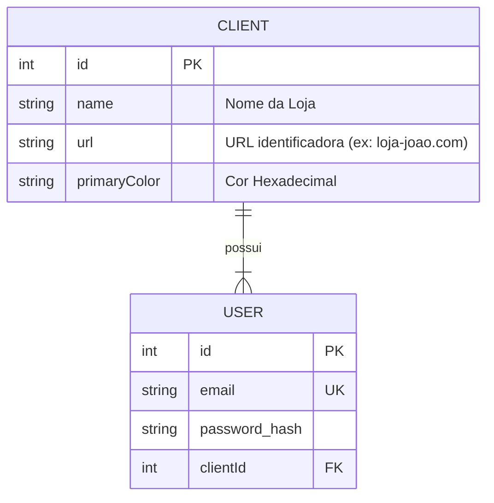

# Ecommerce Whitelabel 2025

Projeto desenvolvido para o processo seletivo, consistindo em uma solução Fullstack (NestJS + Flutter) com arquitetura Whitelabel (Multi-tenant).


## 🚀 Tecnologias Utilizadas

### Backend (API)
- **NestJS**: Framework principal.
- **TypeORM + SQLite**: Persistência de dados.
- **Passport + JWT**: Autenticação segura.
- **Swagger**: Documentação automática da API.
- **Axios**: Consumo das APIs externas (Fornecedores).

### Frontend (App)
- **Flutter**: Framework UI.
- **Riverpod**: Gerenciamento de estado e Injeção de Dependência.
- **Dio**: Cliente HTTP.
- **GoRouter**: Gerenciamento de rotas e redirecionamentos.

---

## 🎨 Arquitetura Whitelabel

A aplicação identifica o cliente baseada na **URL de acesso** (Host Header).
1. O App Flutter consulta a API (`/config`) enviando o host.
2. A API verifica no banco de dados qual `Client` possui aquela URL.
3. A API retorna as configurações visuais (Nome da Loja, Cor Primária).
4. O Flutter reconstrói o `ThemeData` dinamicamente antes de montar a árvore de widgets.

---

## 🗂 Diagrama Entidade Relacionamento (DER)

O banco de dados gerencia a relação entre as Lojas (Clients) e seus Usuários autorizados. Os produtos não são persistidos localmente, sendo consumidos em tempo real dos fornecedores externos.



## 🛠 Como Rodar o Projeto

### 1. Configuração de DNS Local (Essencial para o Whitelabel)
Para simular os domínios dos clientes, adicione as seguintes linhas ao seu arquivo `/etc/hosts` (Linux/Mac) ou `C:\Windows\System32\drivers\etc\hosts` (Windows):

```text
127.0.0.1 devnology.com
127.0.0.1 in8.com
```

### 2. Backend (API)
```bash
cd api
npm install
npm run start:dev
```
Acesse a documentação da API em: `http://localhost:3000/api/docs`


### 3. Frontend (App)
Execute o Flutter Web especificando a porta e o hostname:

```bash
cd app
flutter run -d web-server --web-hostname=0.0.0.0 --web-port=8000
```

### 4. Como Testar
Abra o navegador nas seguintes URLs para ver a mudança de tema:
- **Cliente 1 (Verde):** [http://devnology.com:8000](http://devnology.com:8000)
- **Cliente 2 (Roxo):** [http://in8.com:8000](http://in8.com:8000)

**Usuários de Teste (Gerados automaticamente):**
- Devnology: `joao@email.com` / `123456`
- In8: `maria@email.com` / `123456`
```
